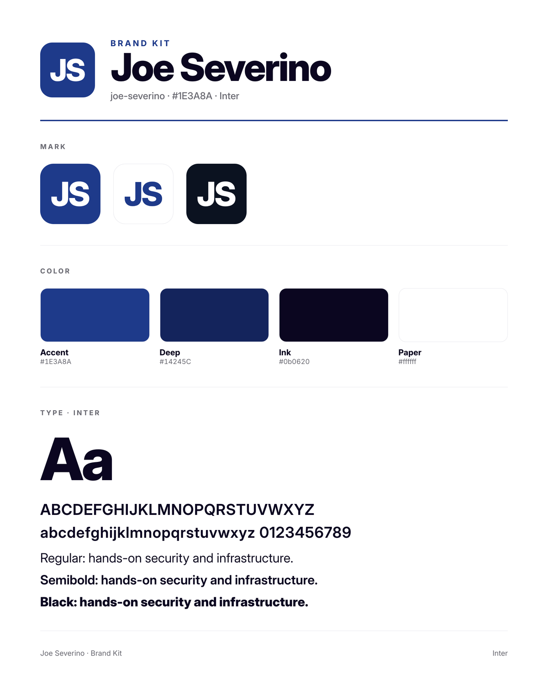
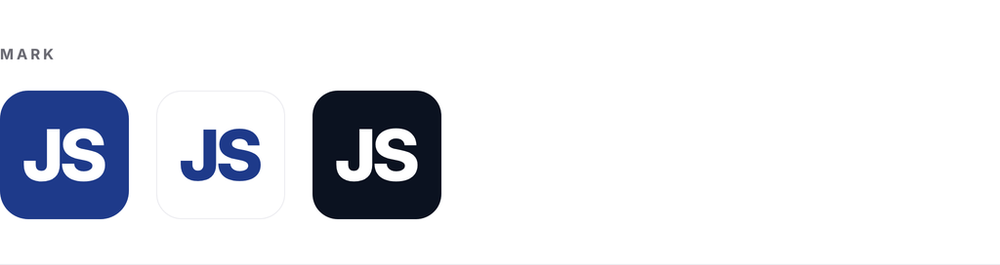
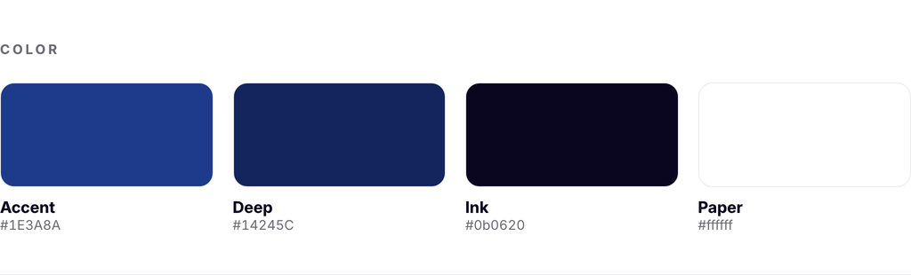
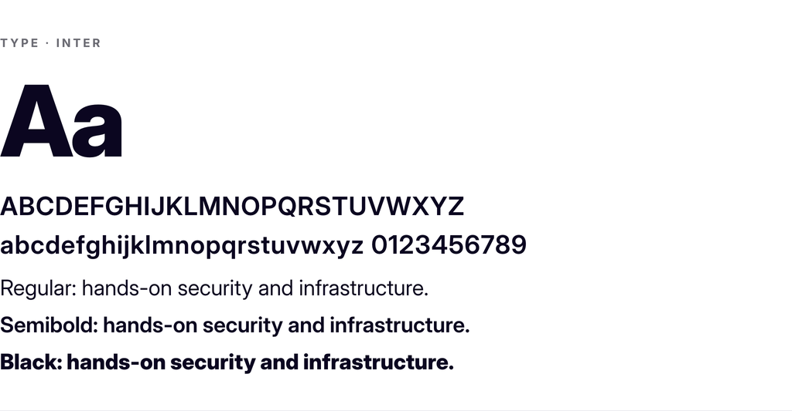

# Joe Severino Brand Kit

The full kit: the poster up top, each section's own image below, then the files,
all generated from the brand's mark, color, and font.

## Mark

Rounded accent tile with a white glyph (default); accent glyph and white glyph on
transparent for light and dark surfaces. In `mark/`: `mark.svg`,
`mark-512/1024.png`, `mark-transparent-light/dark.png`.

## Color

| Role | Hex |
|---|---|
| Accent | `#1E3A8A` |
| Deep | `#14245C` |
| Ink | `#0b0620` |
| Paper | `#ffffff` |

CSS custom properties in `web/tokens.css`.

## Type

Inter (`inter-variable-latin.woff2`).

## Wordmark

Vector-first: `wordmark.svg` (text in `currentColor`) is the source; the `-light/-dark` PNGs rasterize from it. Title case and all-caps both ship.

## Folders

- `icons/` favicons + apple-touch
- `mark/` the mark: vector, raster, transparent light/dark
- `wordmark/` horizontal lockups: `wordmark.svg` + light/dark PNGs, title + caps
- `sheet/` this overview and its section images
- `web/` `tokens.css`, `site.webmanifest`, `head.html` (drop-in wiring)
